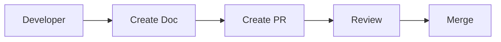

# Documentation Rules

[日本語 (Japanese)](DOCUMENT_RULES.ja.md)

## 1. Documentation Structure

### 1.1 Directory Structure

```plaintext
my-monorepo/
├── docs/                        # Documentation Root
00_project/              # Project Management
│   │   ├── PROJECT_PLAN.md      # Project Plan
│   │   └── CHANGELOG.md         # Changelog
│   ├── 10_design/               # Design Documents
│   │   ├── architecture.md      # Architecture Design
│   │   └── database.md          # DB Design (Phase 2+)
│   ├── 20_development/          # Development Guides
│   │   ├── getting-started.md   # Setup Procedures
│   │   ├── coding-standards.md  # Coding Standards
│   │   └── testing-guide.md     # Testing Guide
│   ├── 30_operations/           # Operations Documents
│   │   ├── deployment.md        # Deployment Procedures
│   │   └── troubleshooting.md   # Troubleshooting
│   └── 99_references/           # References
│       └── external-links.md    # External Links
├── README.md                    # Project Overview (Entry Point)
├── CONTRIBUTING.md              # Contributing Guide
└── LICENSE                      # License
```

### 1.2 Numbering System

| Number Range | Category           | Description                            |
| :----------: | :----------------- | :------------------------------------- |
| `00_`        | Project Management | Plans, Changelogs, Minutes             |
| `10_`        | Design             | Architecture, API Design, DB           |
| `20_`        | Development        | Setup, Coding Standards, Testing       |
| `30_`        | Operations         | Deployment, Monitoring, Incident Response |
| `99_`        | References         | External Links, Glossary               |

---

## 2. Document Creation Rules

### 2.1 File Naming Convention

- Use **lower case kebab-case**: `getting-started.md`
- **Japanese filenames are prohibited**: To prevent character encoding issues
- **Do not include version numbers**: Manage history with Git

### 2.2 Required Metadata

Include the following at the beginning of each document:

```markdown
# Document Title

> **Last Updated**: 2025-12-16
> **Author**: @username
> **Status**: Draft | Review | Approved
```

### 2.3 Markdown Style Guide

| Item           | Rule                                        |
| :------------- | :------------------------------------------ |
| Headings       | Space after `#`, proper hierarchy           |
| Lists          | Use `-` (`*` is deprecated)                 |
| Code Blocks    | Language specification required (`bash, `typescript) |
| Links          | Relative path recommended (`./getting-started.md`) |
| Images         | Place in `docs/assets/`, alt text required  |

---

## 3. Documentation Update Flow

### 3.1 Update Timing

| Trigger      | Update Content                           |
| :----------- | :--------------------------------------- |
| Feature Add  | Update related guides/designs            |
| Bug Fix      | Add to troubleshooting if necessary      |
| Config Change| Update setup/operation procedures        |
| Phase Done   | Record in CHANGELOG.md                   |

### 3.2 Review Process

1. Submit document changes via **Pull Request**
2. Requires **Approval from 1+ person** same as code review
3. Major design changes should be discussed in Issues beforehand

### 3.3 Commit Messages

Commit prefix for documentation changes:

```
docs: Add setup procedure to README
docs(design): Update architecture diagram
docs(fix): Fix typo
```

---

## 4. Documentation Plan by Phase

### Phase 1: Monorepo Foundation Setup

- [ ] `README.md` - Project Overview
- [ ] `docs/20_development/getting-started.md` - Development Environment Setup

### Phase 1.5: Devcontainer Foundation Configuration

- [ ] `docs/20_development/devcontainer-guide.md` - Devcontainer Usage Guide

### Phase 2: Next.js Application Implementation

- [ ] `docs/20_development/coding-standards.md` - Coding Standards
- [ ] `docs/10_design/architecture.md` - Architecture Design

### Phase 3: Amplify Environment Construction via IaC

- [ ] `docs/10_design/infrastructure.md` - Infrastructure Design
- [ ] `docs/30_operations/deployment.md` - Deployment Procedures

### Phase 4: CI/CD Pipeline Construction

- [ ] `docs/30_operations/ci-cd.md` - CI/CD Pipeline Description

### Phase 5: Documentation and Release

- [ ] Final review of all documents
- [ ] `CONTRIBUTING.md` - Contributing Guide
- [ ] `LICENSE` - License File

---

## 5. Templates

### 5.1 New Document Template

```markdown
# [Document Title]

> **Last Updated**: YYYY-MM-DD
> **Author**: @username
> **Status**: Draft

## Overview

[Explain the purpose of this document in 1-2 sentences]

## Table of Contents

- [Section 1](#section-1)
- [Section 2](#section-2)

---

## Section 1

[Content]

## Section 2

[Content]

---

## Related Documents

- [Related Document Name](./path-to-doc.md)
```

---

## 6. Tool Integration

### 6.1 Recommended Tools

| Usage                  | Tool                             |
| :--------------------- | :------------------------------- |
| Document Preview       | VS Code + Markdown Preview       |
| Diagramming            | Mermaid (Embedded in Markdown)   |
| Spell Check            | Code Spell Checker (VS Code Ext) |

### 6.2 Using Mermaid Diagrams

Describe architecture and flow diagrams using Mermaid:



---

_This documentation rule will be updated as the project grows._
