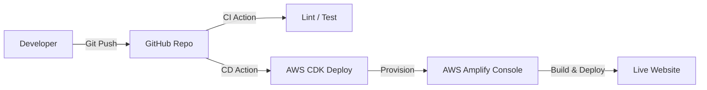

# Project Plan: Next.js + AWS Amplify Monorepo Starter Kit

[日本語 (Japanese)](PROJECT_PLAN.ja.md)

## 1. Project Overview

The objective of this project is to build and publish a starter kit that aggregates modern web development best practices.
The concept is "Launch web sites fastest and provide a scalable foundation," managing everything from frontend to infrastructure (IaC) and CI/CD in a unified manner.

### Target Scope

- **Phase 1 (Current):** Establish a foundation for automated deployment to Amplify Hosting using AWS CDK and build a Next.js website.
- **Phase 2 (Future):** Expand to a full-stack app foundation including NestJS (backend) and database.

## 2. Architecture Design

### 2.1 Technology Stack

| Category            | Technology               | Reason for Selection                                       |
| :------------------ | :----------------------- | :--------------------------------------------------------- |
| **Monorepo**        | **Turborepo**            | Fast build caching, affinity with npm/pnpm/yarn.           |
| **Package Manager** | **pnpm**                 | Disk space efficiency and fast installation.               |
| **Frontend**        | **Next.js (App Router)** | Strong SEO, able to leverage latest React features (RSC).  |
| **Infrastructure**  | **AWS CDK (TypeScript)** | Manage Amplify Console settings as code (IaC) for reproducibility. |
| **Hosting**         | **AWS Amplify**          | Hosting for frontend, ease of CI/CD integration.           |
| **CI/CD**           | **GitHub Actions**       | Used for test automation and CDK deployment pipeline.      |

### 2.2 System Configuration Diagram (Conceptual)



## 3. Directory Structure (Monorepo Configuration)

Adopting a highly extensible configuration anticipating future expansions (NestJS, etc.).

```plaintext
my-monorepo/
├── apps/
│   └── web/                 # Next.js Application Core
│       ├── src/
│       ├── public/
│       ├── next.config.js
│       └── ...
├── infra/                   # Infrastructure Configuration (AWS CDK)
│   ├── bin/
│   ├── lib/                 # Amplify App Resource Definition
│   └── cdk.json
├── packages/                # Shared Packages
│   ├── ui/                  # Shared UI Components (Effective from Phase 2+)
│   ├── tsconfig/            # Shared TypeScript Config
│   └── eslint-config/       # Shared Lint/Prettier Config
├── .github/
│   └── workflows/           # CI/CD Definition
│       ├── ci.yml           # PR Checks (Lint, Test)
│       └── deploy-infra.yml # Infrastructure Deploy on merge to main
├── package.json
├── pnpm-workspace.yaml
└── README.md
```

## 4. Implementation Roadmap

### Phase 1: Monorepo Foundation Setup

- Workspace initialization with pnpm and Turborepo.
- Placement of common settings (tsconfig, eslint-config) under packages/.
- Introduction of code formatter (Prettier).

### Phase 1.5: Devcontainer Foundation Configuration

- Construction of container execution environment using Rancher Desktop.
- Creation of `.devcontainer/` directory.
- Definition of `devcontainer.json` and `Dockerfile`.
- Setup of necessary tools (Node.js, pnpm, AWS CLI, CDK) inside the container.
- Verification of integration with VS Code Remote - Containers extension.

### Phase 2: Next.js Application Implementation (apps/web)

- Scaffolding of Next.js (App Router).
- Basic SEO metadata settings.
- Introduction of UI framework (Tailwind CSS, etc.).
- Build verification (pnpm build).

### Phase 3: Amplify Environment Construction via IaC (infra)

- Initialization of AWS CDK project.
- Definition of Amplify App (L2 Construct or L1).
- GitHub repository integration (AccessToken management).
- Auto Branch Creation settings.
- Codification of Build Spec.

### Phase 4: CI/CD Pipeline Construction

- CI (ci.yml): Execute Lint, Type Check, Unit Test upon Pull Request creation.
- CD (deploy-infra.yml): Execute cdk deploy upon merge to main branch to reflect Amplify setting changes.

### Phase 5: Documentation and Release

- Creation of README.md describing setup procedures and AWS credential settings.
- License notation (MIT License recommended).

## 5. Definition of Done (DoD) per Phase

### Phase 1: Monorepo Foundation Setup

- [ ] `pnpm install` completes without error
- [ ] `pnpm lint` completes successfully in all workspaces
- [ ] `pnpm format` applies code formatting
- [ ] Turborepo caching functions (2nd build is faster)

### Phase 1.5: Devcontainer Foundation Configuration

- [ ] Rancher Desktop is installed and container can be started
- [ ] `devcontainer.json` and `Dockerfile` are placed in `.devcontainer/`
- [ ] "Reopen in Container" works successfully in VS Code
- [ ] `pnpm install` and `pnpm build` succeed inside the container
- [ ] Necessary tools (Node.js, pnpm, AWS CDK CLI) are available inside the container

### Phase 2: Next.js Application Implementation

- [ ] `pnpm build` succeeds
- [ ] Accessible at `localhost:3000` via `pnpm dev`
- [ ] Basic SEO meta tags (title, description, OGP) are set
- [ ] Lighthouse score: Performance 90+, Accessibility 90+

### Phase 3: Amplify Environment Construction via IaC

- [ ] `cdk synth` completes without error
- [ ] `cdk deploy` provisions Amplify App
- [ ] GitHub integration works normally and push triggers build
- [ ] Build succeeds in Amplify Console and site is accessible

### Phase 4: CI/CD Pipeline Construction

- [ ] `ci.yml` runs automatically upon PR creation
- [ ] Lint, Type Check, Unit Test all Pass
- [ ] `deploy-infra.yml` runs upon merge to `main` branch
- [ ] Automatic deployment completes if there are CDK diffs

### Phase 5: Documentation and Release

- [ ] Setup procedures are described in README.md
- [ ] AWS credential setting procedures are documented
- [ ] MIT License file is added
- [ ] New developers can complete setup with README only

---

## 6. Risks and Issues

### 6.1 Technical Risks

| Risk                           | Impact | Probability | Countermeasure                                 |
| :----------------------------- | :----: | :---------: | :--------------------------------------------- |
| Breaking changes in AWS CDK    | Medium | Low         | Pin CDK version, check updates regularly       |
| Complex Amplify build settings | Medium | Medium      | Verify `amplify.yml` for monorepo in test env  |
| pnpm workspace resolution issue| Low    | Medium      | Adjust settings in `.npmrc`, document clearly  |

### 6.2 Security Risks

| Risk                           | Impact | Countermeasure                                     |
| :----------------------------- | :----: | :------------------------------------------------- |
| GitHub Token leakage           | High   | Manage via AWS Secrets Manager, least privilege    |
| Hardcoded AWS credentials      | High   | Use Environment Variables or AWS SSO, enforce `.gitignore` |
| Vulnerabilities in dependencies| Medium | Regular `pnpm audit`, enable Dependabot            |

### 6.3 Operational Issues

- **Cost Management**: Be aware of costs exceeding Amplify free tier.
- **Multi-account Support**: Consider separation of dev/prod environments (Phase 2+).
- **Branch Strategy**: Decide necessity of preview environments for feature branches.

---

## 7. Environment Requirements

### 7.1 Development Machine Requirements

| Item                   | Minimum Requirement                           | Recommended                  |
| :--------------------- | :-------------------------------------------- | :--------------------------- |
| **Node.js**            | v18.17.0+                                     | v20.x LTS                    |
| **pnpm**               | v8.0.0+                                       | v9.x                         |
| **Git**                | v2.30.0+                                      | Latest                       |
| **OS**                 | Windows 10 / macOS 12 / Ubuntu 20.04          | -                            |
| **Container Runtime**  | [Rancher Desktop](https://rancherdesktop.io/) | Recommended as Docker Desktop alternative |

### 7.2 Pre-installation Tools

```bash
# Node.js (Recommended: managed by nvm or volta)
nvm install 20
nvm use 20

# pnpm
npm install -g pnpm@latest

# AWS CDK CLI
npm install -g aws-cdk

# AWS CLI (Optional: for auth configuration)
# https://docs.aws.amazon.com/cli/latest/userguide/getting-started-install.html

# Rancher Desktop (Recommended: required for Devcontainer)
# Download & Install from https://rancherdesktop.io/
# Set Container Engine to "dockerd (moby)" after installation
```

### 7.3 AWS Account Requirements

| Item              | Requirement                                                  |
| :---------------- | :----------------------------------------------------------- |
| **AWS Account**   | Valid account (Free tier usable)                             |
| **IAM Permission**| `AdministratorAccess` or custom policy with:                 |
|                   | - `amplify:*`                                                |
|                   | - `iam:CreateRole`, `iam:AttachRolePolicy`                   |
|                   | - `cloudformation:*`                                         |
|                   | - `s3:*` (For Amplify artifacts)                             |
| **Auth Method**   | AWS SSO recommended, or IAM User Access Keys                 |

### 7.4 GitHub Settings

- **Personal Access Token (PAT)** or **GitHub App** settings
  - Required Scopes: `repo`, `admin:repo_hook`
- Save to AWS Secrets Manager and reference from CDK

---

## 8. Test Strategy

### 8.1 Test Pyramid

```
        /\
       /  \     E2E Tests (Few / High Cost)
      /----\
     /      \   Integration Tests
    /--------\
   /          \ Unit Tests (Many / Low Cost)
  /------------\
```

### 8.2 Test Frameworks

| Layer                 | Tool                     | Target                             |
| :-------------------- | :----------------------- | :--------------------------------- |
| **Unit Test**         | Vitest                   | Components, Utility functions      |
| **Integration Test**  | Vitest + Testing Library | API integration, Component integration |
| **E2E Test**          | Playwright               | User flows, Critical paths         |
| **Visual Regression** | Chromatic (Optional)     | Detecting unintended UI changes    |

### 8.3 Test Coverage Goals

| Target             | Coverage Goal | Note                     |
| :----------------- | :-----------: | :----------------------- |
| Utility Functions  |      90%+     | Ensure logic reliability |
| UI Components      |      70%+     | Cover major state transitions |
| Integration Tests  |       -       | Cover critical paths     |
| E2E Tests          |       -       | User journey based       |

### 8.4 Test Execution Timing

| Timing             | Tests to Run                 |
| :----------------- | :--------------------------- |
| **Local Dev**      | Unit Tests (watch mode)      |
| **Pre-commit**     | Lint + Type Check            |
| **Pull Request**   | Unit + Integration Tests     |
| **After Main Merge**| E2E Tests (Staging Env)      |

### 8.5 Test Directory Structure

```plaintext
apps/web/
├── src/
│   ├── components/
│   │   ├── Button.tsx
│   │   └── Button.test.tsx     # Colocation
│   └── lib/
│       ├── utils.ts
│       └── utils.test.ts
├── tests/
│   ├── integration/            # Integration Tests
│   └── e2e/                    # E2E Tests (Playwright)
└── vitest.config.ts
```

---

## 9. Investigation Results: Rights & Competition

### 9.1 Copyright & License

- No Issues: There are no copyright concerns with the architecture itself (Next.js + Amplify + CDK).
- OSS License: All tools used are OSS and allow redistribution/templating.

### 9.2 Differentiation & Strengths

Advantage over existing boilerplates:

- Pure AWS CDK Configuration: Ensure customizability and transparency by using standard AWS CDK without adopting proprietary abstraction layers like Amplify Gen 2 or SST.
- Practical Monorepo: Maximize DX (Developer Experience) by managing frontend and infrastructure in the same repository.
- Complete CI/CD: Provide a state where automated tests and automated deployment function immediately after cloning.

---

Created by AI Assistant based on user requirements.
