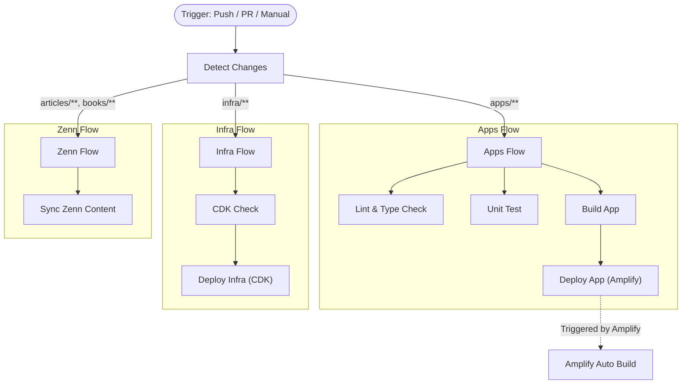

# CI/CD パイプライン仕様書

本ドキュメントでは、このプロジェクトの CI/CD パイプライン (`.github/workflows/ci.yml`) の全体像と仕様について解説します。

> **最終更新**: 2025-12-29
> **対象ワークフロー**: `.github/workflows/ci.yml`

## 概要

本プロジェクトでは、以前分割されていたワークフロー（`ci.yml`, `deploy-infra.yml`, `deploy-app.yml` 等）を単一の `ci.yml` に統合し、**変更検知（Path Filtering）** に基づく効率的なパイプラインを構築しています。

### 主な特徴

- **変更検知**: 変更されたファイルパスに基づいて、必要なジョブのみを実行します（例: `infra/` 変更時のみ CDK デプロイ）。
- **手動実行オプション**: `workflow_dispatch` により、特定の対象（アプリ、インフラ、全て）を指定して手動実行可能です。
- **環境変数チェック**: 必須および任意の環境変数を事前にチェックし、設定漏れを防ぎます。
- **Zenn 自動同期**: Zenn コンテンツの変更を検知し、自動的に同期します。

---

## パイプラインのフロー

---

## 変更検知ロジック (Detect Changes)

`git diff` を使用して、前回のコミット（PRの場合はベースブランチ）との差分を確認し、以下のフラグを立てます。

| フラグ | 対象パス | 説明 |
|--------|---------|------|
| `apps` | `apps/**`, `packages/**`, `package.json` 等 | アプリケーションコードの変更 |
| `infra` | `infra/**` | AWS CDK インフラコードの変更 |
| `zenn` | `articles/**`, `books/**` | Zenn コンテンツの変更 |

### 手動実行時の挙動

手動トリガー (`workflow_dispatch`) で実行する場合、入力パラメータ `target` に応じてフラグを強制的に上書きします。

- **`all`**: `apps=true`, `infra=true`
- **`apps`**: `apps=true`, `infra=false`
- **`infra`**: `apps=false`, `infra=true`

---

## 環境変数 (Environment Variables)

CI/CD パイプラインは、以下の環境変数を必要とします。GitHub Secrets に設定してください。

### 必須変数 (Required)

| 変数名 | 説明 |
|--------|------|
| `REPO_NAME` | リポジトリ名 (Amplify アプリの識別に使用) |
| `AMPLIFY_APP_NAME` | Amplify アプリ名 |
| `AWS_ACCESS_KEY_ID` | AWS アクセスキー (デプロイ用) |
| `AWS_SECRET_ACCESS_KEY` | AWS シークレットキー (デプロイ用) |
| `GH_PAT` | GitHub Personal Access Token (インフラデプロイ時の連携用) |

### 任意変数 (Optional)

| 変数名 | 説明 | 警告 |
|--------|------|------|
| `DOMAIN_NAME` | カスタムドメイン (例: `example.com`) | 未設定の場合、カスタムドメイン設定がスキップされます |

> **Note**: 環境変数が不足している場合、`Detect Changes` ジョブで即座にエラーまたは警告が出力されます。

---

## ジョブ詳細

### 1. Lint & Type Check / Unit Test
- **条件**: `apps` フラグが有効
- **内容**: ESLint, Prettier, TypeScript 型チェック, Jest テストを実行します。

### 2. Build App
- **条件**: `apps` フラグが有効 && `main` ブランチ
- **内容**: Next.js アプリケーションのビルド確認を行います。

### 3. CDK Check
- **条件**: `infra` フラグが有効
- **内容**: `cdk synth` を実行し、CloudFormation テンプレートの生成確認を行います。
- **補足**: `CDK_DEFAULT_ACCOUNT` 等のダミー値を使用して、Secrets なしでもチェックを通過させます。

### 4. Deploy Infrastructure
- **条件**: `infra` フラグが有効 && `main` ブランチ
- **内容**: `npm run deploy:ci` を実行し、AWS CDK でインフラをデプロイします。
- **認証**: AWS Credentials を設定し、自動的にアカウントIDを取得して構成します。

### 5. Deploy App (Amplify)
- **条件**: `apps` フラグが有効 && `main` ブランチ
- **内容**: Amplify へのデプロイをトリガーします（実際にはコードプッシュにより Amplify Console 側でビルドが開始されますが、ここでは明示的なステップとして定義可能です）。
- **現状**: インフラデプロイにて `amplify.yml` が更新されることでもトリガーされます。

---

## 手順: 手動デプロイの実行

特定のコンポーネントのみを再デプロイしたい場合に使用します。

1. GitHub リポジトリの **Actions** タブを開く。
2. 左サイドバーから **CI** ワークフローを選択。
3. **Run workflow** ボタンをクリック。
4. **Branch**: `main` を選択。
5. **Target**: 実行したい対象を選択 (`all`, `apps`, `infra`)。
6. **Run workflow** をクリック。
