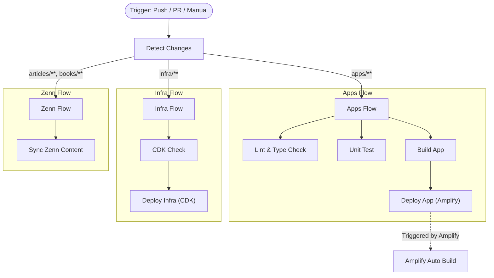

# CI/CD Pipeline Specification

This document describes the overview and specifications of the CI/CD pipeline (`.github/workflows/ci.yml`) for this project.

> **Last Updated**: 2025-12-29
> **Target Workflow**: `.github/workflows/ci.yml`

## Overview

This project consolidates previously separated workflows (`ci.yml`, `deploy-infra.yml`, `deploy-app.yml`, etc.) into a single `ci.yml`, establishing an efficient pipeline based on **Path Filtering** (Change Detection).

### Key Features

- **Change Detection**: Runs only necessary jobs based on changed file paths (e.g., runs CDK deploy only when `infra/` changes).
- **Manual Trigger**: Allows manual execution for specific targets (Apps, Infra, All) via `workflow_dispatch`.
- **Environment Variable Checks**: Validates required and optional environment variables beforehand to prevent configuration errors.
- **Zenn Auto-Sync**: Detects changes in Zenn content and automatically synchronizes them.

---

## Pipeline Flow

---

## Change Detection (Detect Changes)

Uses `git diff` to check for differences against the previous commit (or base branch for PRs) and sets the following flags.

| Flag | Target Path | Description |
|--------|---------|------|
| `apps` | `apps/**`, `packages/**`, `package.json`, etc. | Application code changes |
| `infra` | `infra/**` | AWS CDK infrastructure code changes |
| `zenn` | `articles/**`, `books/**` | Zenn content changes |

### Manual Execution

When triggered manually (`workflow_dispatch`), flags are forcibly overwritten based on the `target` input parameter.

- **`all`**: `apps=true`, `infra=true`
- **`apps`**: `apps=true`, `infra=false`
- **`infra`**: `apps=false`, `infra=true`

---

## Environment Variables

The CI/CD pipeline requires the following environment variables. Please set them in GitHub Secrets.

### Required Variables

| Variable Name | Description |
|--------|------|
| `REPO_NAME` | Repository name (Used for Amplify App identification) |
| `AMPLIFY_APP_NAME` | Amplify App Name |
| `AWS_ACCESS_KEY_ID` | AWS Access Key (For deployment) |
| `AWS_SECRET_ACCESS_KEY` | AWS Secret Access Key (For deployment) |
| `GH_PAT` | GitHub Personal Access Token (For repo integration during infra deploy) |

> **Note**: For internal runs and deployments, the pipeline will **fail** if these variables are missing. For Fork PRs, strict checks are skipped to allow external contributions.

### Optional Variables

| Variable Name | Description | Warning |
|--------|------|------|
| `DOMAIN_NAME` | Custom Domain (e.g., `example.com`) | If unset, custom domain configuration is skipped |

---

## Job Details

### 1. Lint & Type Check / Unit Test
- **Condition**: `apps` flag is true
- **Content**: Executes ESLint, Prettier, TypeScript type checking, and Jest tests.

### 2. Build App
- **Condition**: `apps` flag is true && `main` branch
- **Content**: Verifies the build of the Next.js application.

### 3. CDK Check
- **Condition**: `infra` flag is true
- **Content**: Executes `cdk synth` to verify CloudFormation template generation.
- **Note**: Uses dummy values (e.g., `CDK_DEFAULT_ACCOUNT`) to pass checks even without Secrets (useful for PRs from forks).

### 4. Deploy Infrastructure
- **Condition**: `infra` flag is true && `main` branch
- **Content**: Executes `npm run deploy:ci` to deploy infrastructure using AWS CDK.
- **Authentication**: Configures AWS Credentials and automatically retrieves/configures the Account ID.

### 5. Deploy App (Amplify)
- **Condition**: `apps` flag is true && `main` branch
- **Content**: Triggers deployment to Amplify (In reality, code push triggers build on Amplify Console side, but this can be defined as an explicit step).
- **Status**: Also triggered by `amplify.yml` updates in the infrastructure deployment.

---

## Guide: Manual Deployment

Use this when you want to re-deploy only specific components.

1. Open the **Actions** tab in the GitHub repository.
2. Select the **CI** workflow from the left sidebar.
3. Click the **Run workflow** button.
4. **Branch**: Select `main`.
5. **Target**: Select the target to execute (`all`, `apps`, `infra`).
6. Click **Run workflow**.
